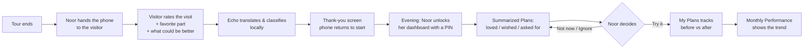
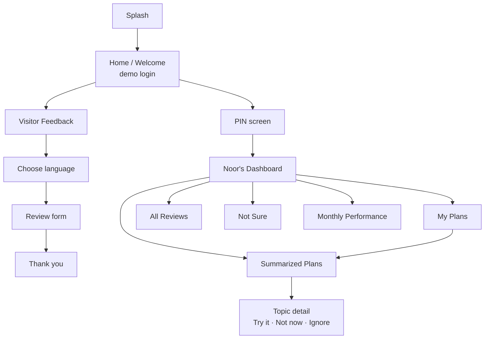
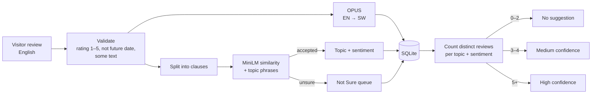
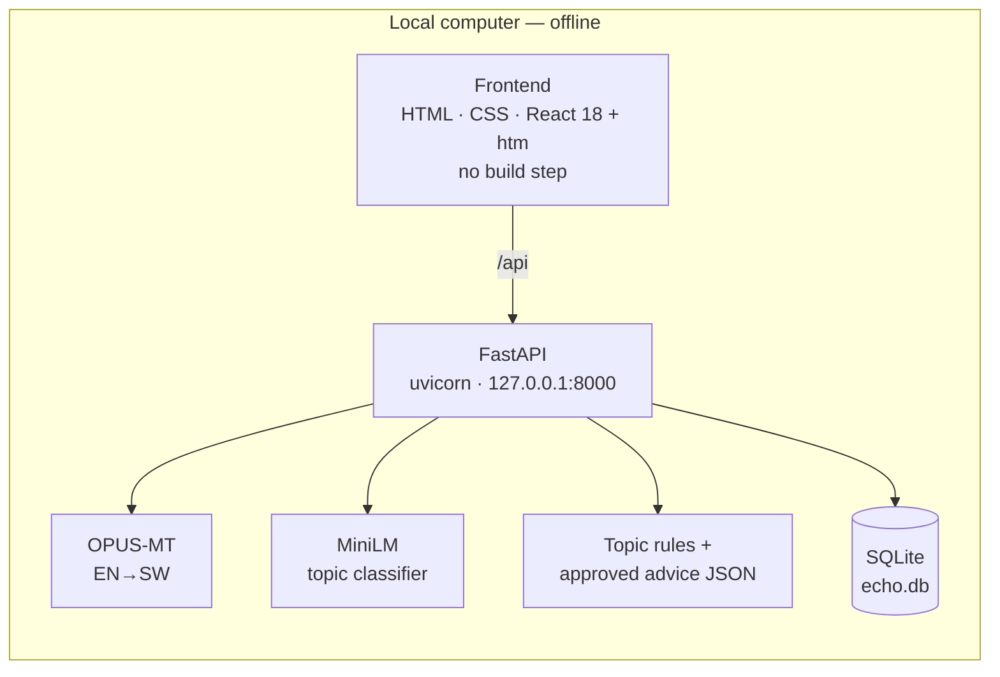

# Echo — Design Document

> **Every visitor, heard.**
> An offline app that turns visitor feedback into AI-powered insights and suggestions for small tourism operators.

**Hackathon:** World Bank × Hack-Nation — *Small AI for Development* (Global AI Hackathon 2026)
**Track:** Annex C — Tourism · Workflow: *Learning from visitor feedback*
**Persona:** Noor, who runs a small coffee-farm tour in Kenya
**Local language:** Kiswahili (dashboard and translated reviews)

---

## 1. Problem

Noor's farm is not listed on any digital platform. Visitors find it by word of mouth and arrive with a local guide who translates for them. They leave happy, but Noor has no way of knowing **why**:

- which parts of the visit created the most value,
- what worked and what did not,
- or which parts are worth building into a new product, a return visit, or a referral.

Like most small operators, she runs on instinct. Feedback is scattered, partly in languages she cannot read, and gone once the tour ends.

### Problem statement

> Because of Echo, **Noor** will **see what visitors loved, what they wished was different, and what to try next** **within minutes of a visit** — feedback she would otherwise **never capture, or only hear about secondhand through her guide**. We know because the Annex C brief describes small operators with no digital presence who "know visitors leave happy, but not why."

---

## 2. Design goals

| Goal | What it means in Echo |
|---|---|
| **Works offline** | Core features — submitting, translating, classifying, suggesting, tracking — run on local files with no internet after one-time setup. |
| **Small AI, targeted** | Two small local models do two narrow jobs (translate, classify). No large language model and no cloud API. |
| **Human makes the call** | The AI suggests from a fixed, reviewed advice library. Noor decides *Try it*, *Not now*, or *Ignore*. |
| **Fail safe, not confident and wrong** | When the classifier is unsure, or fewer than 3 visitors mention something, Echo says so instead of guessing. |
| **Local language** | Noor can read the whole dashboard and every review in Kiswahili, with the visitor's original English underneath. |
| **Simple for a non-technical owner** | One phone-style screen at a time, large tap targets, plain language, short cards. |

---

## 3. Users and journeys

### Noor (owner)
Runs a family coffee farm. Has a basic smartphone and a shared computer, limited time, and no marketing background. Wants to know what to change and what to keep.

### Visitor
A tourist at the end of a tour. Has 1–2 minutes, writes in English, and may never return.

### Where Echo sits in Noor's day

---

## 4. Information architecture

The app has three bottom tabs: **Visitor Feedback**, **Home**, and **Noor's Dashboard**.

### Screens

| Screen | Purpose | Key elements |
|---|---|---|
| **Splash** | Brand moment | Echo lockup, "Every visitor, heard.", *Works without internet* pill |
| **Home / Welcome** | Sign in to the business account | Username, password with Show/Hide, demo login, Sign up; becomes "Welcome, Noor" after login |
| **Choose language** | Visitor picks their language | English (the model input language); note that Noor sees Kiswahili + original English |
| **Review form** | Collect feedback in under a minute | Date picker (*Select a date*), 1–5 stars, *Favorite part*, *What could be better*, consent checkbox, Submit |
| **Thank you** | Close the loop and reset | Confirmation, *Saved on this phone*, 20-second auto-return |
| **PIN** | Keep owner data private | 4-digit keypad, lockout after repeated wrong tries |
| **Dashboard home** | One-glance status | Reviews this week, average rating, five section cards, EN/SW language switch |
| **Summarized Plans** | What the AI found | Cards grouped as *Loved most*, *Wished was different*, *Visitors asked for*, each with an AI summary, AI suggestion, visitor count and confidence |
| **Topic detail** | Decide what to do | Supporting reviews, confidence explainer, **Try it / Not now / Ignore** |
| **My Plans** | Follow through | Trying now / Saved for later / Done, **Before vs After** comparison, *View Summarized Plans* button |
| **All Reviews** | The raw record | Filters (All, 5★, 4★, 3★ and below), *Sort by* (Most Recent, Oldest to Newest), Kiswahili + original English |
| **Not Sure** | Human-in-the-loop fail-safe | Reviews the AI could not place; Noor picks from the model's two most likely topics (good / to improve) or *None of these* |
| **Monthly Performance** | Long-term view | Month selector (*Select a month*), average stars, change vs previous month, AI "potentially why", plans tried that month, review table |

---

## 5. AI design

Echo uses **two small, local models** plus deterministic rules. No text is ever generated by the AI.

| Component | Model / method | Job | Size on disk |
|---|---|---|---|
| Translation | `Helsinki-NLP/opus-mt-en-sw` (OPUS-MT) | English → Kiswahili for every review | ~284 MB |
| Topic classification | `all-MiniLM-L6-v2` sentence embeddings + explicit topic phrases | Map each clause to one of 17 coffee-farm topics | ~87 MB |
| Sentiment | Deterministic rules (negation, requests, praise, field, rating) | Positive / negative / neutral / request | — |
| Suggestions | Fixed, reviewed advice library (`echo_suggestions.json`) | Select, never write, advice | — |

### Review pipeline

### Topics (17)

`guide_quality`, `coffee_education`, `coffee_roasting`, `coffee_tasting`, `farm_tour_content`, `tour_difficulty`, `timing_pacing`, `group_size`, `facilities`, `transportation`, `accessibility`, `price_value`, `staff_service`, `souvenirs`, `information_signage`, `scenery`, `local_culture`

### Decision thresholds

| Rule | Value |
|---|---|
| Phrase match accepted if topic cosine score ≥ | **0.30** |
| Semantic-only match accepted if best score ≥ | **0.42** with **≥ 0.06** margin over the runner-up |
| No accepted topic | Review goes to **Not Sure** |
| Suggestion shown when distinct matching reviews are | **3–4 → Medium**, **5+ → High** |
| Plan result needs | **3+ new reviews** after the plan starts |
| "No change" band for plan results | Shift of **≤ 10 percentage points** |

Cosine scores are similarity scores, not calibrated probabilities. Echo therefore never upgrades a confidence level from the classifier score alone.

### Why AI, and not a simpler tool

| Simpler tool | Why it is not enough for Noor |
|---|---|
| Paper comment cards | Noor cannot read many of them, and they never get counted. |
| SMS / WhatsApp | Feedback arrives, but nobody groups 200 messages into patterns. |
| A spreadsheet | Requires typing, translating and tagging every review by hand — the analytical work small operators cannot do themselves. |
| Online review sites | Noor's farm is not listed; most visitors never post. |

Echo's AI does the part Noor cannot: **read every review in her language, group what visitors keep saying, and point to the next step**, while leaving the decision to her.

---

## 6. Guardrails and responsible AI

| Guardrail | How Echo applies it |
|---|---|
| **Human in the loop** | Every suggestion needs Noor's *Try it*, *Not now* or *Ignore*. Echo never acts on her behalf. |
| **"Not sure — ask a person"** | Low-confidence reviews go to **Not Sure** with the prompt *Check with your guide*. Topics mentioned by fewer than 3 visitors show *Not enough reviews yet* instead of advice. |
| **No hallucinations** | Summaries and suggestions are selected from a fixed, reviewed library. The model classifies; it never writes advice. |
| **Corrections, not silent retraining** | Noor's labels in *Not Sure* are saved as `manual_override`. The original `model_prediction` is kept for audit. |
| **Privacy** | Reviews are anonymous (no names collected) and stored in a local SQLite database. Nothing leaves the device. |
| **Consent** | The form states Noor will read the review; sharing with future visitors is a separate opt-in checkbox. |
| **Access control** | Owner data needs an account login **and** a 4-digit PIN. Passwords and PINs use salted PBKDF2-SHA256; five wrong PINs trigger a 30-second lockout. |
| **Honest data** | All demo data is marked **Synthetic** on the dashboard and on each review card. |
| **Bias awareness** | Classification runs on the original English, not translated text. Kiswahili output needs native-speaker review, and less-supported languages are routed to the guide instead of guessed. |

---

## 7. Visual design system

The look is warm, quiet and coffee-toned: a paper-like canvas, brown accents and a serif wordmark. It should feel like a guest book, not a corporate dashboard.

### Brand

- **Name:** Echo — feedback that comes back to the farm.
- **Logo:** an ear inside a speech bubble (listening to visitors), in brown line art with a gradient.
- **Tagline:** *Every visitor, heard.*

### Color tokens

| Token | Hex | Use |
|---|---|---|
| `--brand` | `#784E29` | Primary buttons, active tabs, selected chips, icons |
| `--brand-press` | `#5E3C1F` | Pressed state |
| `--tint` | `#F3ECE3` | Icon tiles, pressed backgrounds |
| `--canvas` | `#FAF8F4` | App background |
| `--surface` | `#FFFFFF` | Cards, inputs, sheets |
| `--text` / `--text2` / `--text3` | `#000000` / `#5C554D` / `#6E6559` | Primary, secondary and tertiary text |
| `--line` / `--line-input` | `#E6DED3` / `#8C8277` | Dividers / input borders |
| `--ok` | `#3E6B3A` | Saved, Better, upward trends |
| `--warn` | `#8A5A00` | Not Sure, low confidence |
| `--err` | `#A3322A` | Errors, destructive actions |
| Accent | `#BDA49C` | Owner's name in *Welcome, Noor* |
| `--bezel` | `#2A1D12` | Phone frame |

### Typography

| Role | Font |
|---|---|
| Wordmark and *Welcome* heading | **Lora** (serif) |
| Everything else | **Inter** (sans-serif) |

Fonts are bundled in `frontend/vendor/`, so typography also works offline.

### Components

- **Cards** with soft shadows for every dashboard section and review.
- **Pill inputs and buttons** on the login screen; full-width primary buttons on forms.
- **Chips** for filters, and a pill **Sort by** dropdown.
- **Bottom sheets** for the calendar, month picker, delete confirmation and explainers.
- **Toasts with Undo** after every reversible action (delete, label, plan change).
- **AI blocks**, labelled *AI SUMMARY* / *AI SUGGESTION* with a sparkle icon, so AI output is always visibly marked.
- **Language tags** (`SW`, `EN`) on review text.

### Layout

A single 412 × 915 Android-sized phone frame, scaled to fit desktop screens and full-bleed on real phones. Bottom navigation is three tabs: **Visitor Feedback · Home · Noor's Dashboard**.

---

## 8. Accessibility and inclusivity

- Tap targets of at least 44–52 px; star buttons are 48 px.
- Semantic roles on custom controls (radio groups for stars and filters, `aria-pressed`, `aria-live` for the PIN and toasts).
- Error messages are shown in text with an icon, never by color alone.
- The dashboard switches fully between English and Kiswahili.
- Visitors get a short form with examples ("For example, roasting the coffee") and a 300-character limit.
- Works on a low-end device in a browser, with no app-store install.

---

## 9. Architecture and tech stack

| Layer | Technology |
|---|---|
| Frontend | HTML, CSS, JavaScript; React 18 and htm loaded from bundled files (no npm build) |
| Backend | Python 3.10+, FastAPI, Uvicorn, Pydantic |
| AI | PyTorch, Hugging Face Transformers, SentencePiece; OPUS-MT EN→SW and all-MiniLM-L6-v2 |
| Storage | SQLite (users, sessions, reviews, plans, decisions) |
| Testing | pytest (API, models, demo import), Playwright browser check with external requests blocked |

Main API routes: `/api/auth/*`, `/api/pin/*`, `/api/reviews`, `/api/reviews/{id}/classification`, `/api/dashboard`, `/api/suggestions`, `/api/plans`, `/api/performance/monthly`, `/health`.

---

## 10. Data

- **Demo data:** 225 synthetic reviews for Noor's Coffee Farm across all 12 months of 2026 (seed 42). They are processed by the real models and marked `is_synthetic: true`.
- **Built-in scenarios:**
  - Coffee-tasting complaints reach **High** confidence.
  - Group-size complaints reach **Medium** confidence.
  - Seating requests stay below the threshold, so no suggestion is shown.
  - A *Clearer directions* plan started in May shows **Better**.
- **Taxonomy grounding:** topic phrase coverage was checked against a 1,500-review tourism reference sample. Only aggregate counts are kept, and no reference text ships with the app.
- **Live data:** new visitor reviews are stored with `is_synthetic: false`, and future dates are rejected.

See [`docs/SYNTHETIC_DEMO.md`](docs/SYNTHETIC_DEMO.md) and [`docs/OFFLINE_IMPLEMENTATION.md`](docs/OFFLINE_IMPLEMENTATION.md) for full details.

---

## 11. How the design maps to the judging criteria

| Criterion | Where Echo answers it |
|---|---|
| **Built solution (25%)** | End-to-end flow: visitor review → local translation + classification → suggestions → plans → monthly results, all offline. |
| **Development relevance (20%)** | Directly addresses Annex C: an operator with no digital presence learns what value she creates and what to build on. |
| **Data grounding (15%)** | 17-topic taxonomy checked against tourism reference data; clearly labelled synthetic demo; explicit thresholds. |
| **Evidence it works (15%)** | Real model outputs, automated tests with the network blocked, measured High/Medium/none cases. |
| **Clarity, design, value of AI (15%)** | Phone-first UI, bilingual dashboard, AI output always labelled, and a clear comparison with simpler tools. |
| **Scalability (10%)** | Taxonomy and advice are plain JSON files, so another farm, homestay or tour can reuse Echo by swapping the topic and advice library. |
| **Responsible AI (pass/fail)** | *Not Sure* fail-safe, 3-review minimum, fixed advice library, human decision on every action, local-only data, PIN protection. |

---

## 12. Limitations and next steps

### Current limitations

- Echo runs on a local computer (served at `127.0.0.1`) with a phone-style interface. It is not yet packaged as an installable phone app.
- The two models total about 370 MB. That is fine to side-load once, but too heavy for a very weak connection; quantized versions are the next step.
- Visitor input is English only. Other languages are handled by the guide.
- Classifier thresholds are initial heuristics, not validated on a labelled tourism test set.
- Kiswahili translations need native-speaker review.
- Plan results show changes in feedback patterns, not proven cause and effect.

### Next steps

1. Quantize OPUS and MiniLM (int8) to cut download size and run on Android.
2. Package as a PWA or an Android app for true on-phone use.
3. Add visitor input in Kiswahili, German and French.
4. Let Noor turn top praise into a shareable listing blurb, to help with digital presence and referrals.
5. Build a small labelled evaluation set from real farm reviews to tune the thresholds.

---

## 13. Team

World Bank × Hack-Nation Global AI Hackathon 2026 — Columbia Hub.
