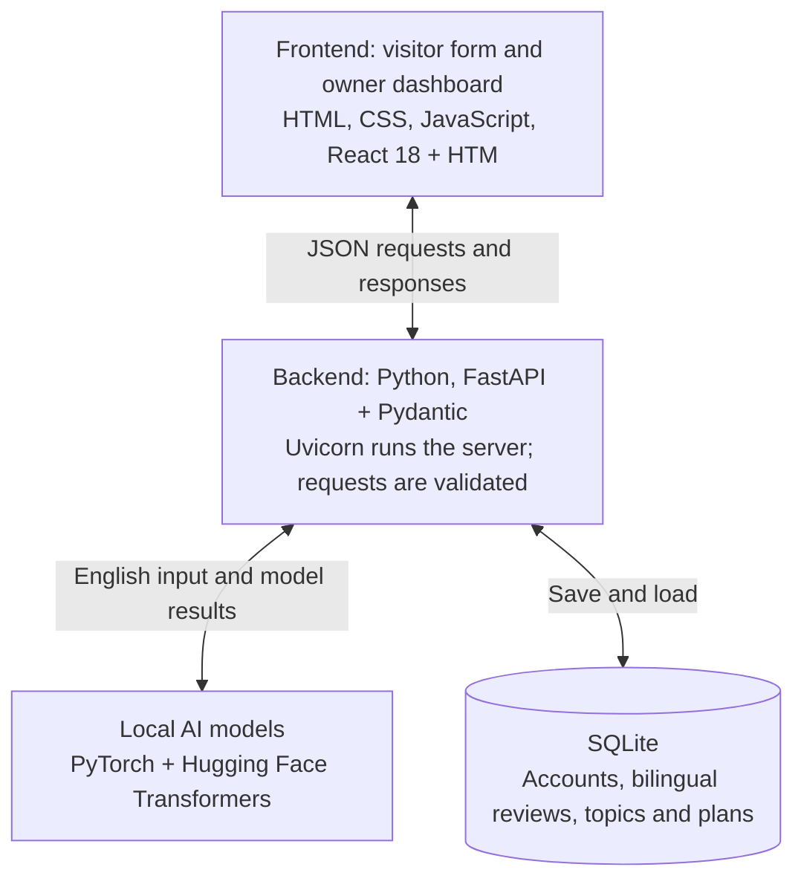
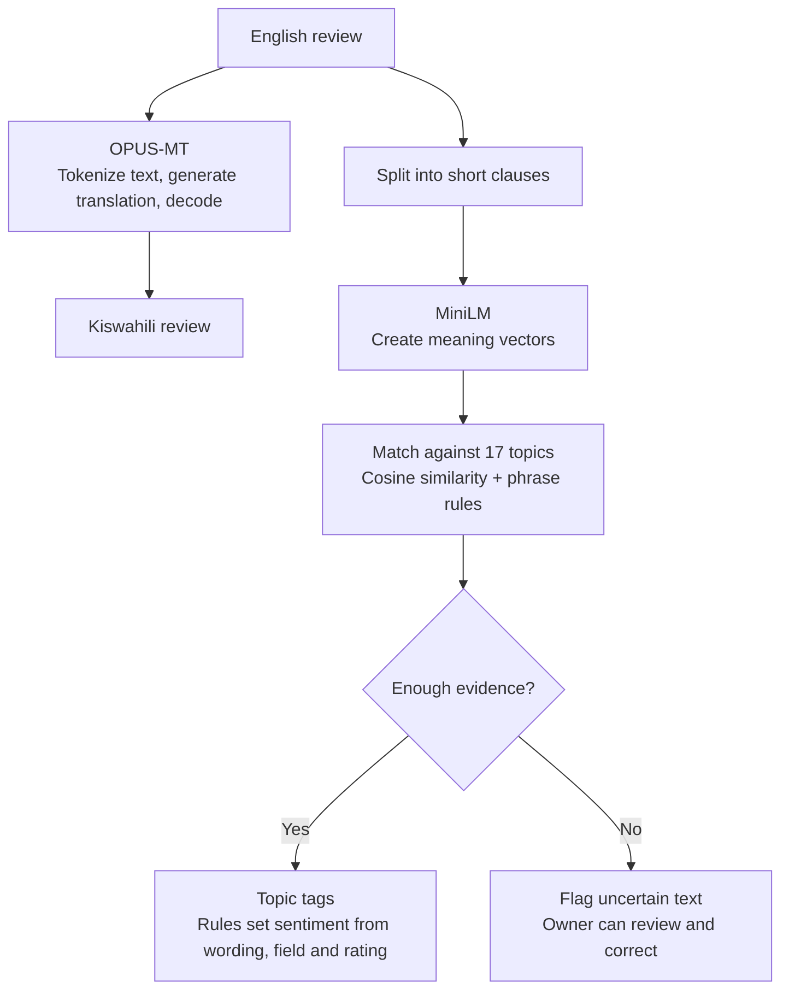
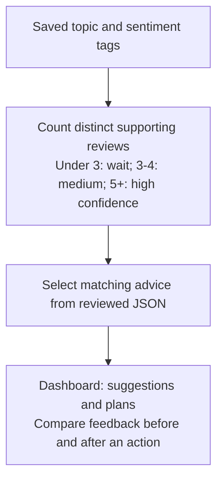

# Echo Tech Stack in One Minute

Follow the arrows.

## 1. Frontend and backend

## 2. Model logic

Both models receive the **original English review**.

## 3. From reviews to action

**Access:** PBKDF2-SHA256 password/PIN hashes and HttpOnly session cookies.
**Checks:** pytest, HTTPX and Playwright.

**Offline:** Shell/PowerShell setup downloads models once online. Then run locally
at `127.0.0.1:8000`, with bundled browser assets and 225 demo reviews.

Setup: [README.md](README.md). Product journeys: [DESIGN.md](DESIGN.md).
